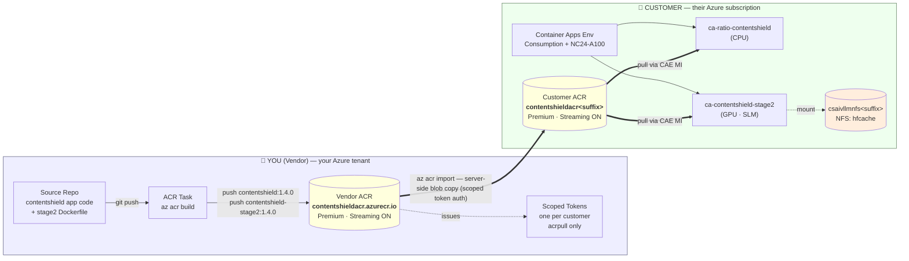
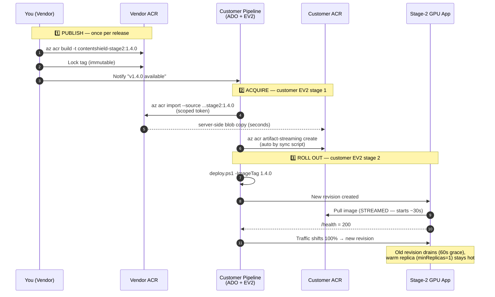
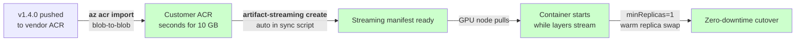
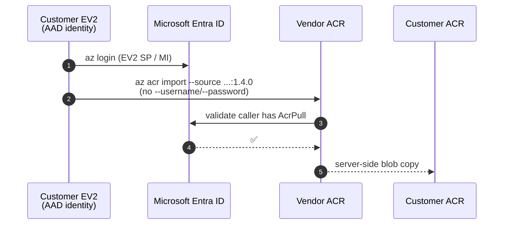

# ContentShield — Container Distribution & Update Flow

This doc answers four questions:

1. **What do you (vendor) host?**
2. **What do customers deploy?**
3. **How does a new image version flow from you to a running customer container?**
4. **What does each side have to do per release?**

> Quick index: [Architecture](#1-architecture-who-hosts-what) · [Release flow](#2-release-flow-sequence) · [Side-by-side responsibilities](#3-who-does-what) · [Vendor checklist](#4-vendor-per-release-checklist) · [Customer pipeline](#5-customer-per-release-pipeline) · [Why it's fast](#6-where-the-speed-comes-from) · [Onboarding (external)](#7-onboarding-a-new-customer) · [Onboarding (internal MS)](#7b-internal-microsoft-customer-same-aad-tenant--simpler-onboarding)

---

## 1. Architecture: who hosts what



**Key idea:** one vendor ACR for all customers. Customers each get an isolated, scoped-pull token. Images travel **registry → registry** (server-side blob copy, never through anybody's laptop).

---

## 2. Release flow (sequence)



---

## 3. Who does what

| Artifact | Hosted by | Deployed by | Consumed by |
|---|---|---|---|
| Source code + Dockerfiles | You (git) | You (ACR Task on commit) | — |
| **Vendor ACR** `contentshieldacr.azurecr.io` | **You.** Single registry, all customers. | You, once. | Customer EV2 pipelines (read-only). |
| Scoped pull tokens (`pull-acme`, `pull-axa`, …) | You issue per customer. | You. | Customer pipeline (stored in their KV / ADO secret). |
| **Customer ACR** `contentshieldacr<suffix>` | Customer. | Customer EV2 (`main.bicep` → `modules/acr.bicep`). | Customer's Container Apps Env via system MI (`AcrPull`). |
| Container Apps + Env + Network + Content Safety + APIM | Customer. | Customer EV2 (`deploy.ps1` / `main.bicep`). | End users. |
| `csaivllmnfs<suffix>` NFS share | Customer. | Customer EV2 (`modules/storage.bicep`). | Stage-2 container as `HF_HOME`. |

---

## 4. Vendor per-release checklist

Run from your dev box (or CI):

```powershell
# 1. Build straight in the vendor ACR — no local 10 GB tar.
az acr build `
  -r contentshieldacr `
  -t contentshield-stage2:1.4.0 `
  -f Dockerfile.stage2 .

az acr build `
  -r contentshieldacr `
  -t contentshield:1.4.0 `
  -f Dockerfile .

# 2. Lock the tags so they can never be overwritten.
az acr repository update `
  --name contentshieldacr `
  --image contentshield-stage2:1.4.0 `
  --write-enabled false

# 3. (Optional) sign with cosign / Notary v2.

# 4. Notify customers — release notes / Teams / webhook to their pipeline.
```

Artifact streaming on the **vendor** side is optional (only the customer ACR pulls matter for cold-start). On the **customer** side it's already automatic — see §6.

---

## 5. Customer per-release pipeline

Two ADO stages. Both already wired into the scripts in this repo.

### Stage 1 — Acquire

```yaml
- task: AzureCLI@2
  displayName: 'Sync images from vendor ACR'
  inputs:
    azureSubscription: $(serviceConnection)
    scriptType: pscore
    scriptLocation: scriptPath
    scriptPath: infra/contentshield/scripts/sync-images-from-vendor.ps1
    arguments: >
      -TargetAcrName contentshieldacr$(suffix)
      -VendorAcrFqdn contentshieldacr.azurecr.io
      -VendorAcrTokenName $(VendorAcrTokenName)
      -VendorAcrTokenPassword $(VendorAcrTokenPassword)
      -Tag 1.4.0
      -Force
```

What this does:
- `az acr import` of `contentshield:1.4.0` and `contentshield-stage2:1.4.0` (server-side blob copy).
- Aliases the same digest as `:latest` in the customer ACR.
- **Auto-enables ACR Artifact Streaming** on each repo (`--enable-auto-streaming True`) **and** force-creates a streaming manifest for the imported tag.

### Stage 2 — Deploy

```yaml
- task: AzureCLI@2
  displayName: 'Deploy ContentShield infra'
  inputs:
    azureSubscription: $(serviceConnection)
    scriptType: pscore
    scriptLocation: scriptPath
    scriptPath: infra/contentshield/deploy.ps1
    arguments: >
      -ResourceGroup $(rgName)
      -ApimPublisherEmail $(ops)
      -ImageTag 1.4.0
      -SkipImageImport
```

What this does:
- Runs `main.bicep` against the existing RG.
- Pins `appImage` / `stage2Image` to `contentshieldacr<suffix>.azurecr.io/<repo>:1.4.0` (the version, never `:latest`).
- Creates a new container app revision and shifts 100% traffic once `/health` returns healthy.

### What customers store as secrets

| Variable | Source | Sensitivity |
|---|---|---|
| `VendorAcrTokenName` | You issue at onboarding | Low — username |
| `VendorAcrTokenPassword` | You issue at onboarding | **High** — store in Azure Key Vault, surface via ADO variable group |
| `serviceConnection` | Customer's ADO → Azure SP / federated identity | n/a |

---

## 6. Where the speed comes from



| Stage | Before | After (this repo) |
|---|---|---|
| Image transfer to customer ACR | docker pull → docker push (10 GB over WAN, minutes–hours) | `az acr import`, server-side, **seconds** |
| First pull on a cold GPU node | full image download before container starts (5–15 min) | **Artifact Streaming** → container starts in ~30–90 s |
| Revision swap | scale-from-zero cold start | `minReplicas=1` warm replica + 60 s grace period |
| Stage-2 startup probe | 240 s ceiling | **600 s** — survives even worst-case first-pull |

---

## 7. Onboarding a new customer

One-time per customer, on the vendor side:

```powershell
# 1. Create a scoped token with acrpull on both repos.
az acr scope-map create `
  --name "scope-acme" `
  --registry contentshieldacr `
  --repository contentshield content/read metadata/read `
  --repository contentshield-stage2 content/read metadata/read

az acr token create `
  --name "pull-acme" `
  --registry contentshieldacr `
  --scope-map "scope-acme"
# → returns username + password1/password2. Hand off securely.
```

Give the customer:

| Item | Example |
|---|---|
| Vendor ACR FQDN | `contentshieldacr.azurecr.io` |
| Token name | `pull-acme` |
| Token password | (hand off via 1Password / encrypted secret) |
| Current image tag | `1.4.0` |
| This repo (or a vendored copy of `infra/contentshield/`) | git URL or zip |

That's it. The customer plugs those four values into their ADO variable group and the two-stage pipeline above just works.

---

## 7b. Internal Microsoft customer (same AAD tenant) — simpler onboarding

When your customer's subscription lives in the same AAD tenant as the vendor ACR (e.g. dogfood, internal MS teams), **skip the scoped token entirely** and use AAD/MI auth.

### What changes

| | External customer (scoped token) | Internal MS customer (AAD) |
|---|---|---|
| Vendor hands off | Token name + password (rotates) | Nothing — just the ACR FQDN and image tag |
| Customer pipeline secrets | `VendorAcrTokenName`, `VendorAcrTokenPassword` | none (uses the existing EV2 service connection identity) |
| Auth model | ACR scoped token, `acrpull` only | AAD role assignment on the vendor ACR |
| `az acr import` | `--username/--password` | no creds — uses current az login |
| Token rotation | Periodic, by vendor | Never (AAD-managed) |
| Revocation | Delete the token | Remove the role assignment |

### Vendor side — one-time per internal customer

```powershell
# Customer tells you the object ID of the identity their pipeline runs as
# (EV2 service principal, federated MI, etc.)
$customerEv2Identity = '<objectId>'

az role assignment create `
  --assignee-object-id $customerEv2Identity `
  --assignee-principal-type ServicePrincipal `
  --role AcrPull `
  --scope $(az acr show -n contentshieldacr --query id -o tsv)
```

That's the entire vendor-side onboarding. No tokens, no scope-maps, no password handoff.

### Customer side — pipeline shape

Same two stages, fewer arguments:

```yaml
# Stage 1: Acquire (AAD)
- task: AzureCLI@2
  inputs:
    scriptPath: infra/contentshield/scripts/sync-images-from-vendor.ps1
    arguments: >
      -TargetAcrName contentshieldacr$(suffix)
      -VendorAcrFqdn contentshieldacr.azurecr.io
      -Tag 1.4.0
      -UseAad
      -Force
    # No VendorAcrTokenName / VendorAcrTokenPassword needed.

# Stage 2: Deploy (unchanged)
- task: AzureCLI@2
  inputs:
    scriptPath: infra/contentshield/deploy.ps1
    arguments: >
      -ResourceGroup $(rgName)
      -ApimPublisherEmail $(ops)
      -VendorAcrFqdn contentshieldacr.azurecr.io
      -ImageTag 1.4.0
      -UseAad
```

### Sequence (AAD variant)



### When to still use the token flow

- Customers in **different tenants** (external MSPs, partners, true SaaS customers).
- Customers in air-gapped clouds without AAD federation to your tenant.
- Anywhere you want crisper per-customer revocation/audit without touching IAM on the vendor ACR.

Both flows coexist — `-UseAad` is just a switch on the same two scripts.

---

## 8. Future evolution (not implemented yet)

Already-staged hooks in this repo that you can grow into without re-architecting:

| Future change | Already prepared by |
|---|---|
| Ship SLM weights as a separate ORAS artifact instead of baking into stage-2 image | Add a blob account + grant stage-2 MI `Storage Blob Data Reader`; swap pre-warm job source from HF Hub to blob. |
| Pre-warm HF cache with weights at deploy time | ✅ Done. `modules/hfPrewarmJob.bicep` runs at end of `deploy.ps1`. |
| Pin EV2 to image digest instead of tag | `ImageTag` param in `deploy.ps1` can take `@sha256:…` form unchanged. |
| Per-customer signing verification | ACR is Premium; enable content trust + cosign at any time. |
| Private endpoint between customer pipeline and vendor ACR | Vendor ACR is Premium; add a PE and approve from the customer side without code changes. |
